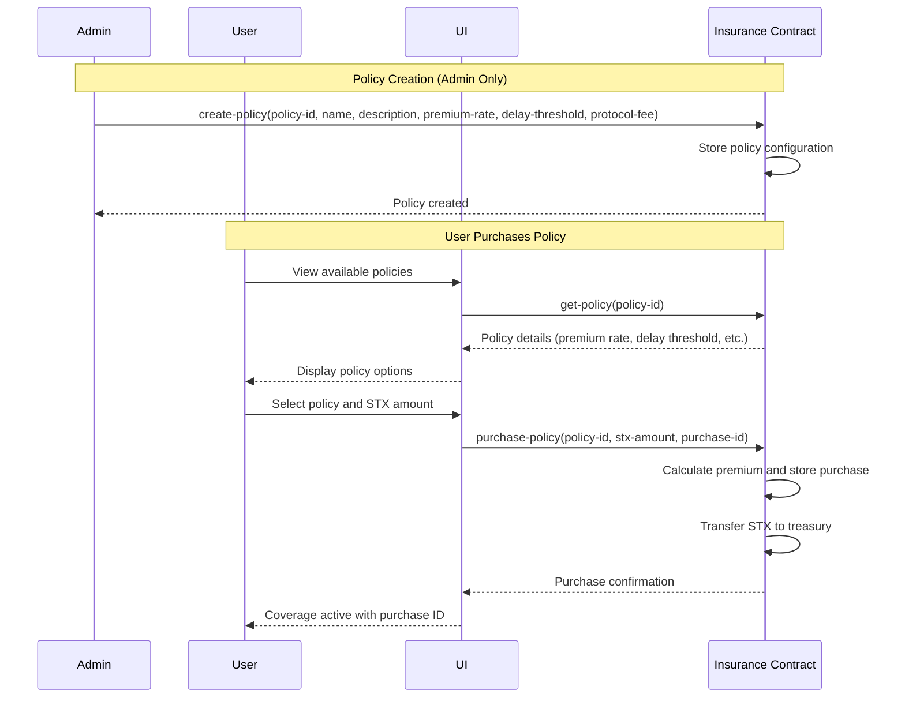
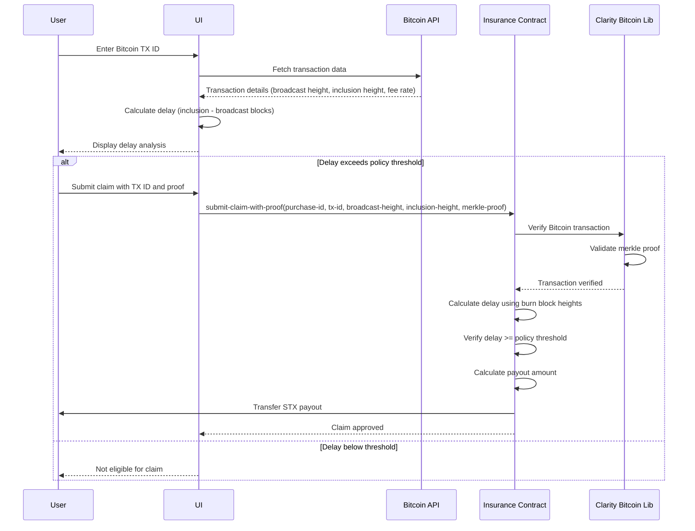
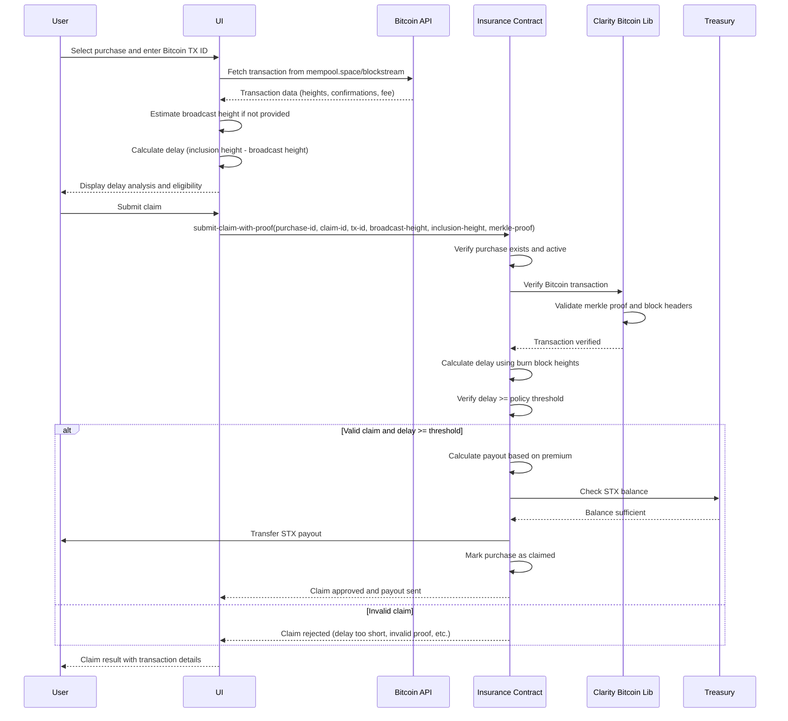
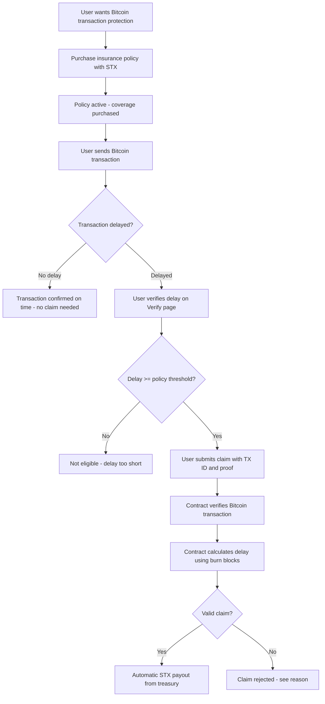

# ⚡ HyperInsure

The first on-chain insurance protocol protecting blockchain users from transaction latency, mempool congestion, and finality delays, powered by Stacks + Bitcoin security.

[](https://nextjs.org/)
[](https://www.stacks.co/)
[](https://bitcoin.org/)

## Overview

HyperInsure provides non-intrusive, verifiable insurance coverage for risks associated with transaction delays. Instead of paying high "tips" on top of base fees, users can purchase affordable insurance policies that provide protection against various types of transaction delays.

## Key Features

- **Transaction Delay Protection**: Coverage for transactions stuck in mempools
- **Mempool Congestion Insurance**: Protection during high network activity periods
- **Finality Risk Coverage**: Insurance against finality delays across congested networks
- **Non-Intrusive Implementation**: No additional parameters or code modifications needed
- **Verifiable Claims Process**: Transparent, on-chain verification of delays

## How It Works

1. **Purchase Coverage**: Users purchase coverage by paying STX tokens and selecting a policy
2. **Bitcoin Transaction Verification**: Users provide Bitcoin transaction details (TX ID, broadcast height, inclusion height)
3. **Delay Calculation**: The system calculates delay using Bitcoin burn block heights (inclusion height - broadcast height)
4. **Smart Contract Verification**: Clarity smart contracts verify Bitcoin transaction proofs and calculate delays
5. **Automatic Payouts**: If delay ≥ policy threshold, payouts are automatically released from the STX treasury

## Smart Contract Architecture

> **Note**: The diagrams below show the conceptual architecture. The current implementation uses direct Bitcoin transaction verification via Clarity Bitcoin Library, without requiring an RPC Proxy.

### Interaction Diagrams

#### 1. Policy Creation and Purchase Flow



#### 2. Bitcoin Transaction Delay Verification



#### 3. Complete Claim Processing Flow



#### 4. Complete User Journey



HyperInsure is built on a streamlined contract architecture with core components:

1. **HYPERINSURE_CORE_V2**: Main contract managing policies, purchases, claims, and treasury functions
   - `create-policy`: Admin function to create new insurance policies
   - `purchase-policy`: User function to purchase coverage
   - `submit-claim-with-proof`: User function to submit claims with Bitcoin transaction proofs
   - `set-admin`: Admin function to change contract administrator
   
2. **Clarity Bitcoin Library**: Provides Bitcoin transaction verification on-chain
   - Verifies Bitcoin transaction existence
   - Validates merkle proofs
   - Calculates block heights and delays

3. **Insurance Treasury**: Manages STX reserves for instant payouts

4. **Governance Contract** (optional): Controls protocol parameters and upgrades

## Technology Stack

### Frontend
- **Next.js 15.2.4** - React framework with App Router
- **React 19** - UI library
- **TypeScript** - Type safety
- **Tailwind CSS** - Utility-first CSS framework
- **shadcn/ui** - Accessible component library
- **@stacks/connect-react** - Stacks wallet integration
- **@stacks/transactions** - Stacks transaction building
- **sonner** - Toast notifications
- **lucide-react** - Icon library
- **framer-motion** - Animations

### Blockchain
- **Stacks blockchain** - Layer 1 blockchain
- **Clarity smart contracts** - Decidable smart contract language
- **Bitcoin security** - Burn block heights for objective time measurement
- **Clarity Bitcoin Library** - Bitcoin transaction verification on-chain
- **HYPERINSURE_CORE_V2** - Main insurance contract managing policies, purchases, and claims

## Getting Started

### Prerequisites
- Node.js 18+
- pnpm (recommended) or npm/yarn

### Installation

```bash
# Clone the repository
git clone https://github.com/AmaanSayyad/HyperInsure.git

# Navigate to the project directory
cd HyperInsure

# Install dependencies
pnpm install
# or
npm install

# Create environment file
cp .env.example .env.local
# Edit .env.local with your contract addresses and configuration

# Start the development server
pnpm dev
# or
npm run dev
```

Visit `http://localhost:3000` to view the application.

### Environment Variables

Create a `.env.local` file in the root directory with the following variables:

```env
# Network Configuration
NEXT_PUBLIC_NETWORK=testnet
NEXT_PUBLIC_STACKS_API_URL=https://api.testnet.hiro.so
NEXT_PUBLIC_DEPLOYER_ADDRESS=ST19EWTQXJHNE6QTTSJYET2079J91CM9BRQ8XAH1V

# Core Insurance Contracts
NEXT_PUBLIC_HYPERINSURE_CORE_V2_CONTRACT=ST19EWTQXJHNE6QTTSJYET2079J91CM9BRQ8XAH1V.hyperinsure-core-v2
NEXT_PUBLIC_CLARITY_BITCOIN_CONTRACT=ST19EWTQXJHNE6QTTSJYET2079J91CM9BRQ8XAH1V.clarity-bitcoin
NEXT_PUBLIC_INSURANCE_TREASURY_CONTRACT=ST19EWTQXJHNE6QTTSJYET2079J91CM9BRQ8XAH1V.insurance-treasury-v2
NEXT_PUBLIC_POLICY_MANAGER_CONTRACT=ST19EWTQXJHNE6QTTSJYET2079J91CM9BRQ8XAH1V.policy-manager
NEXT_PUBLIC_CLAIM_PROCESSOR_CONTRACT=ST19EWTQXJHNE6QTTSJYET2079J91CM9BRQ8XAH1V.claim-processor

# Enhanced Contracts
NEXT_PUBLIC_FRONTEND_API_CONTRACT=ST19EWTQXJHNE6QTTSJYET2079J91CM9BRQ8XAH1V.frontend-api

# Governance and Oracle
NEXT_PUBLIC_GOVERNANCE_CONTRACT=ST19EWTQXJHNE6QTTSJYET2079J91CM9BRQ8XAH1V.governance
NEXT_PUBLIC_ORACLE_CONTRACT=ST19EWTQXJHNE6QTTSJYET2079J91CM9BRQ8XAH1V.oracle

# Legacy (if using older contracts)
NEXT_PUBLIC_HYPERINSURE_CORE_CONTRACT=ST19EWTQXJHNE6QTTSJYET2079J91CM9BRQ8XAH1V.hyperinsure-core

# Bitcoin API Configuration
NEXT_PUBLIC_BITCOIN_API_URL=https://mempool.space/testnet/api
NEXT_PUBLIC_BITCOIN_NETWORK=testnet
NEXT_PUBLIC_MEMPOOL_API_URL=https://mempool.space/testnet/api
NEXT_PUBLIC_CLARITY_BITCOIN_MAINNET=SP2PABAF9FTAJYNFZH93XENAJ8FVY99RRM50D2JG9.clarity-bitcoin-lib-v5

# Explorer
NEXT_PUBLIC_EXPLORER_URL=https://explorer.hiro.so

# Policy Defaults (optional)
NEXT_PUBLIC_DEFAULT_DELAY_THRESHOLD=35
NEXT_PUBLIC_DEFAULT_POLICY_DURATION=1000
NEXT_PUBLIC_MIN_PREMIUM_AMOUNT=100000
NEXT_PUBLIC_MAX_COVERAGE_AMOUNT=100000000000

# Debug Settings (optional)
NEXT_PUBLIC_DEBUG_MODE=false
NEXT_PUBLIC_ENABLE_CONSOLE_LOGS=false
```

> **Note**: Replace the contract addresses above with your actual deployed contract addresses. The deployer address `ST19EWTQXJHNE6QTTSJYET2079J91CM9BRQ8XAH1V` is an example - use your own deployer address.

See `lib/stacks-config.ts` for all available configuration options and their default values.

### Contract Explorer Links

All deployed contracts can be viewed on the Stacks Explorer:

| Contract Name | Contract ID | Explorer Link |
|--------------|-------------|---------------|
| **HyperInsure Core V2** | `ST19EWTQXJHNE6QTTSJYET2079J91CM9BRQ8XAH1V.hyperinsure-core-v2` | [View on Explorer](https://explorer.hiro.so/txid/ST19EWTQXJHNE6QTTSJYET2079J91CM9BRQ8XAH1V.hyperinsure-core-v2?chain=testnet&tab=overview) |
| **Clarity Bitcoin** | `ST19EWTQXJHNE6QTTSJYET2079J91CM9BRQ8XAH1V.clarity-bitcoin` | [View on Explorer](https://explorer.hiro.so/txid/ST19EWTQXJHNE6QTTSJYET2079J91CM9BRQ8XAH1V.clarity-bitcoin?chain=testnet&tab=overview) |
| **Insurance Treasury V2** | `ST19EWTQXJHNE6QTTSJYET2079J91CM9BRQ8XAH1V.insurance-treasury-v2` | [View on Explorer](https://explorer.hiro.so/txid/ST19EWTQXJHNE6QTTSJYET2079J91CM9BRQ8XAH1V.insurance-treasury-v2?chain=testnet&tab=overview) |
| **Policy Manager** | `ST19EWTQXJHNE6QTTSJYET2079J91CM9BRQ8XAH1V.policy-manager` | [View on Explorer](https://explorer.hiro.so/txid/ST19EWTQXJHNE6QTTSJYET2079J91CM9BRQ8XAH1V.policy-manager?chain=testnet&tab=overview) |
| **Claim Processor** | `ST19EWTQXJHNE6QTTSJYET2079J91CM9BRQ8XAH1V.claim-processor` | [View on Explorer](https://explorer.hiro.so/txid/ST19EWTQXJHNE6QTTSJYET2079J91CM9BRQ8XAH1V.claim-processor?chain=testnet&tab=overview) |
| **Frontend API** | `ST19EWTQXJHNE6QTTSJYET2079J91CM9BRQ8XAH1V.frontend-api` | [View on Explorer](https://explorer.hiro.so/txid/ST19EWTQXJHNE6QTTSJYET2079J91CM9BRQ8XAH1V.frontend-api?chain=testnet&tab=overview) |
| **Governance** | `ST19EWTQXJHNE6QTTSJYET2079J91CM9BRQ8XAH1V.governance` | [View on Explorer](https://explorer.hiro.so/txid/ST19EWTQXJHNE6QTTSJYET2079J91CM9BRQ8XAH1V.governance?chain=testnet&tab=overview) |
| **Oracle** | `ST19EWTQXJHNE6QTTSJYET2079J91CM9BRQ8XAH1V.oracle` | [View on Explorer](https://explorer.hiro.so/txid/ST19EWTQXJHNE6QTTSJYET2079J91CM9BRQ8XAH1V.oracle?chain=testnet&tab=overview) |
| **HyperInsure Core** (Legacy) | `ST19EWTQXJHNE6QTTSJYET2079J91CM9BRQ8XAH1V.hyperinsure-core` | [View on Explorer](https://explorer.hiro.so/txid/ST19EWTQXJHNE6QTTSJYET2079J91CM9BRQ8XAH1V.hyperinsure-core?chain=testnet&tab=overview) |

> **Note**: Replace `ST19EWTQXJHNE6QTTSJYET2079J91CM9BRQ8XAH1V` with your actual deployer address in the links above. The contract names should match your deployed contracts.

## Usage

### Complete User Workflow

#### 1. Purchase Insurance Policy
1. Navigate to the **Purchase** page (`/purchase`)
2. Connect your Stacks wallet
3. Select an insurance policy (Starter, Professional, or Enterprise)
4. Enter the amount of STX to deposit as premium
5. Review premium rate, delay threshold, and protocol fee
6. Complete the purchase transaction
7. Your purchase ID will be stored and displayed

#### 2. View Your Policies
1. Navigate to the **Policies** page (`/policies`)
2. View available policies created by admins
3. See your purchased policies with details:
   - Policy name and ID
   - Delay threshold
   - Premium paid
   - Coverage amount
   - Expiration status
4. Use search and filters to find specific policies
5. Get alerts for policies expiring soon

#### 3. Verify Transaction Delay (Optional)
1. Navigate to the **Verify** page (`/verify`)
2. Enter your Bitcoin transaction ID (TX ID)
3. Optionally provide broadcast block height
4. Click "Analyze Delay" to check:
   - Estimated broadcast height
   - Confirmation height
   - Delay in blocks and minutes
   - Fee rate analysis
   - Eligibility for claim

#### 4. Submit a Claim
1. Navigate to the **Claim** page (`/claim`)
2. Connect your Stacks wallet (must match purchase wallet)
3. Select the policy purchase you want to claim for
4. Enter your Bitcoin transaction ID
5. Optionally provide broadcast block height (or let system estimate)
6. Click "Verify & Analyze Delay"
7. Review the delay analysis:
   - If eligible: Transaction delay exceeds policy threshold
   - If not eligible: See why (delay too short, transaction not confirmed, etc.)
8. If eligible, click "Submit Claim"
9. Receive instant verification and automatic payout if approved

### Admin Features

#### Create Policies
1. Navigate to the **Admin** page (`/admin`)
2. Connect with admin wallet
3. Go to "Policies" tab
4. Fill in policy details:
   - Policy ID (e.g., POL-001)
   - Policy name
   - Description
   - Premium rate (percentage)
   - Delay threshold (blocks)
   - Protocol fee (percentage)
5. Submit transaction to create policy

#### Manage Admin Access
1. Navigate to the **Admin** page (`/admin`)
2. Go to "Admin Settings" tab
3. View current admin address
4. Update admin address (requires current admin wallet)
5. Submit transaction to change admin

#### View System Statistics
1. Navigate to the **Admin** page (`/admin`)
2. View "Overview" tab for:
   - Total policies and purchases
   - Total deposits and payouts
   - Contract balance and revenue
   - System health metrics

## Application Pages

- **Home (`/`)**: Landing page with features, coverage plans, testimonials, FAQ, and CTA
- **Policies (`/policies`)**: Dashboard to view available policies and your purchased policies
- **Purchase (`/purchase`)**: Purchase insurance coverage with STX tokens
- **Verify (`/verify`)**: Verify Bitcoin transaction delays before submitting claims
- **Claim (`/claim`)**: Submit insurance claims for delayed Bitcoin transactions
- **Admin (`/admin`)**: Admin panel for creating policies, managing admin access, and viewing statistics

## Key Features Implemented

✅ **Policy Management**: Admins can create customizable insurance policies  
✅ **Policy Purchase**: Users can purchase coverage with STX tokens  
✅ **Bitcoin Transaction Verification**: Automatic verification of Bitcoin transaction delays  
✅ **Claim Submission**: Submit claims with Bitcoin transaction proofs  
✅ **Automatic Payouts**: Instant payouts when delay exceeds threshold  
✅ **Real-time Statistics**: Admin dashboard with system metrics  
✅ **Wallet Integration**: Seamless Stacks wallet connection  
✅ **Transaction Tracking**: View all purchases and claims on-chain  
✅ **Policy Expiration Alerts**: Notifications for expiring policies  
✅ **Modern UI/UX**: Beautiful, responsive design with glassmorphism effects  

## Future Roadmap

We plan to extend HyperInsure to cover additional blockchain risks:

- Wallet theft protection via Arkham
- Transaction failure coverage
- Gas-spike hedging
- Validator risk coverage
- Cross-chain finality protection
- Mobile app for iOS and Android
- Multi-signature wallet support
- Insurance pool sharing

## Contact

For questions or support, please reach out to us at:
- PitchDeck: https://docs.google.com/presentation/d/1EkrUS-6aj6qx1YxMwxP_RauebVnhXj5RC8IYZp5XFBw/edit?usp=sharing 
- Twitter: [@HyperInsure](https://x.com/hyperinsure)
