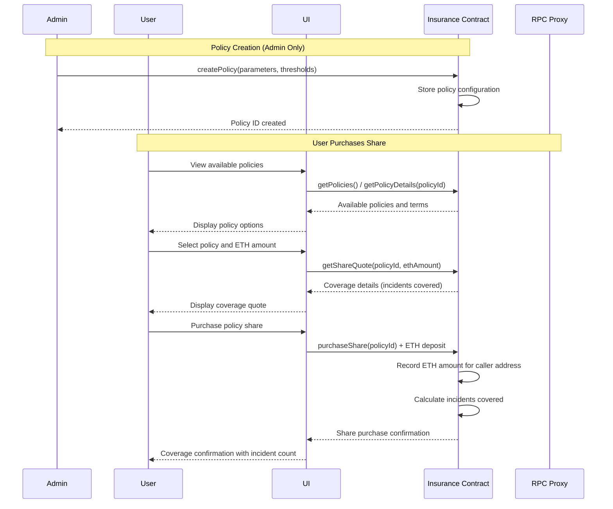
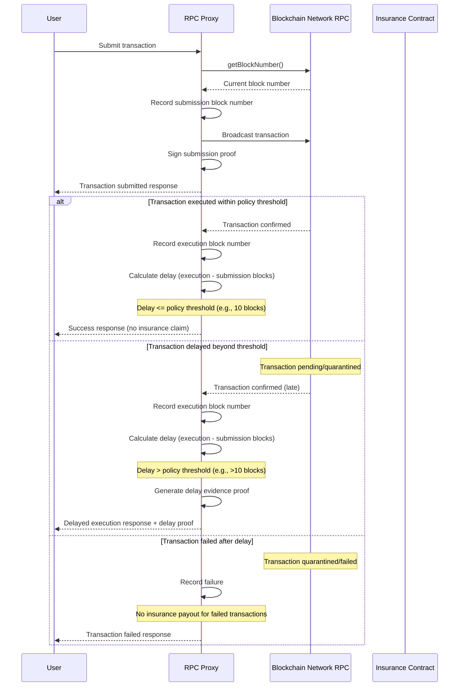
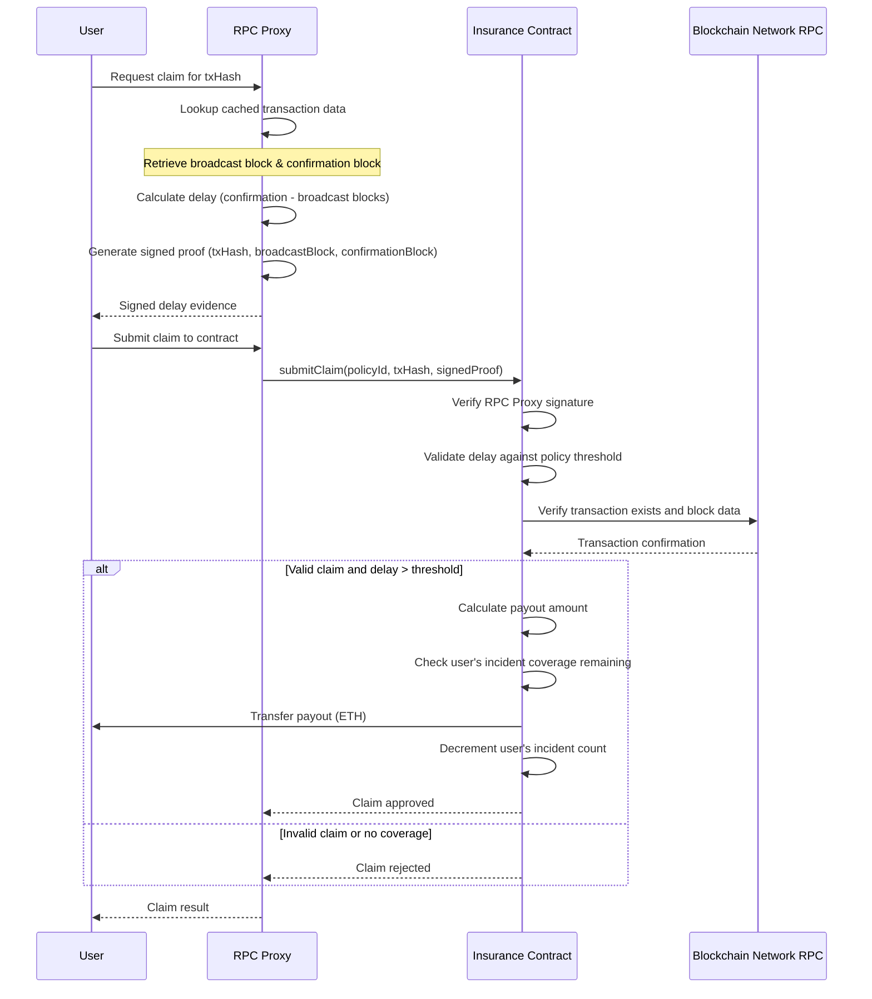
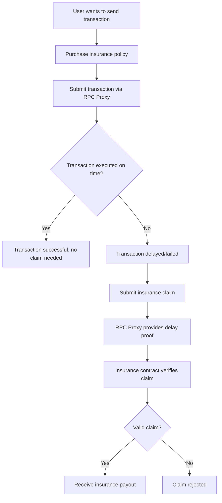

# ⚡ HyperInsure

The first on-chain insurance protocol protecting blockchain users from transaction latency, mempool congestion, and finality delays, powered by Stacks + Bitcoin security.

[](https://nextjs.org/)
[](https://www.stacks.co/)
[](https://bitcoin.org/)

## Overview

HyperInsure provides non-intrusive, verifiable insurance coverage for risks associated with transaction delays. Instead of paying high "tips" on top of base fees, users can purchase affordable insurance policies that provide protection against various types of transaction delays.

## Key Features

- **Transaction Delay Protection**: Coverage for transactions stuck in mempools
- **Mempool Congestion Insurance**: Protection during high network activity periods
- **Finality Risk Coverage**: Insurance against finality delays across congested networks
- **Non-Intrusive Implementation**: No additional parameters or code modifications needed
- **Verifiable Claims Process**: Transparent, on-chain verification of delays

## How It Works

1. **Purchase Coverage**: Users purchase coverage by paying STX tokens
2. **RPC Proxy API**: Our system records broadcast height at transaction submission
3. **Oracle Attestation**: Once included, an oracle signs an attestation of broadcast → inclusion delay
4. **Smart Contract Verification**: Clarity smart contracts verify proofs and release payouts if delay ≥ threshold

## Smart Contract Architecture EVM vs Stacks

### Interaction Diagrams

#### 1. EVM Tech Architecture vs Stacks Insurance Policy Purchase Flow



#### 2. EVM Tech Architecture vs Stacks Txn Broadcasting with Delay Tracking 



#### 3. EVM Tech Architecture vs Stacks Insurance Claim Processing Flow



#### 4. Complete User Journey



HyperInsure is built on a streamlined contract architecture with three core components:

1. **Core Contract**: Manages policies, purchases, claims, and treasury functions
2. **Oracle Contract**: Handles attestations for transaction delays
3. **Governance Contract**: Controls protocol parameters and upgrades

## Technology Stack

### Frontend
- Next.js 15.2.4
- React 19
- Tailwind CSS
- shadcn/ui components

### Blockchain
- Stacks blockchain
- Clarity smart contracts
- Bitcoin security through burn block heights
- Secp256k1-signed oracle attestations

## Getting Started

### Prerequisites
- Node.js 18+
- npm or yarn

### Installation

```bash
# Clone the repository
git clone https://github.com/AmaanSayyad/hyperinsure.git

# Navigate to the project directory
cd hyperinsure

# Install dependencies
npm install

# Start the development server
npm run dev
```

Visit `http://localhost:3000` to view the application.

## Usage

### Purchase Insurance
1. Navigate to the Purchase page
2. Select an insurance policy
3. Enter the amount of STX to insure
4. Complete the purchase
5. Submit transaction details for claims

6. Navigate to the Claim
7. Enter the wallet address for the claim to be transferred
3. Submit your claim
4. Receive instant verification and payout if eligible

## Future Roadmap

We plan to extend HyperInsure to cover additional blockchain risks:

- Wallet theft protection via Arkham
- Transaction failure coverage
- Gas-spike hedging
- Validator risk coverage
- Cross-chain finality protection

## Contact

For questions or support, please reach out to us at:
- PitchDeck: https://docs.google.com/presentation/d/1EkrUS-6aj6qx1YxMwxP_RauebVnhXj5RC8IYZp5XFBw/edit?usp=sharing 
- Twitter: [@HyperInsure](https://x.com/hyperinsure)
